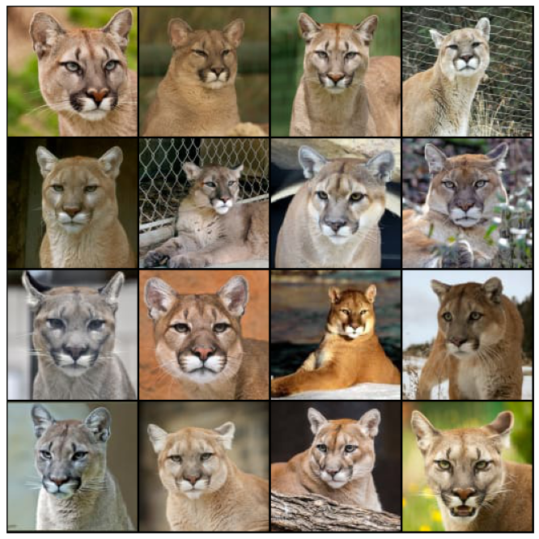
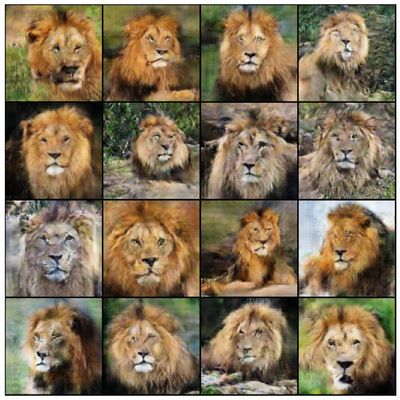
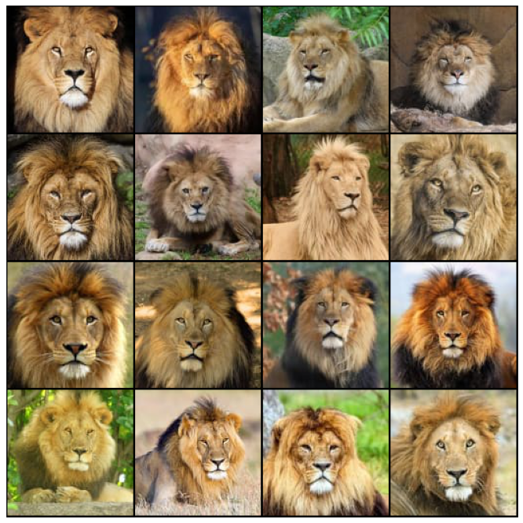
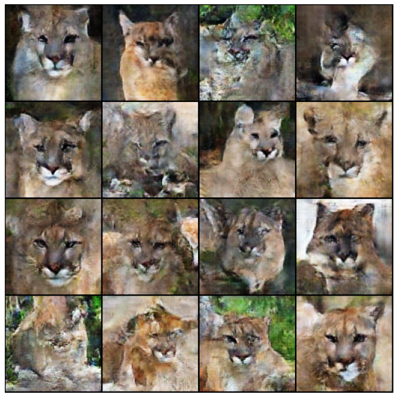
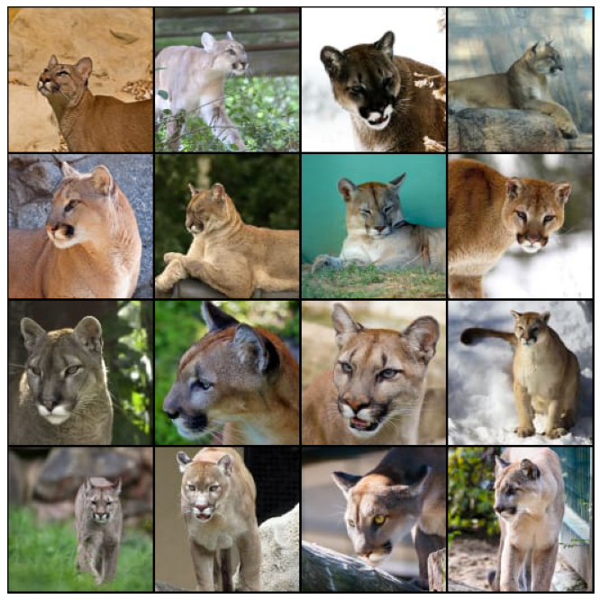
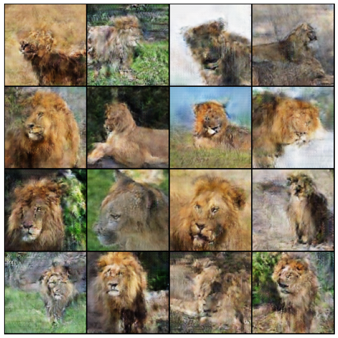
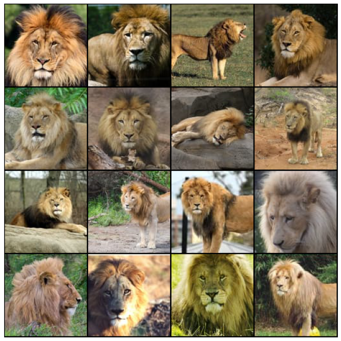
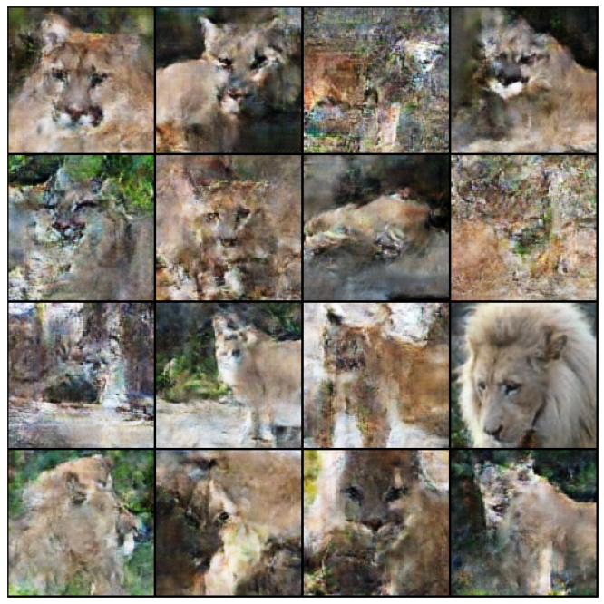

# PumaToLion With CycleGAN

## Идея
В этом учебном проекте я решил попробовать обучить сеть типа CycleGAN добавлять львиную гриву пумам.  
Почему именно эта идея?  
В основном источнике по CycleGAN -  
*Unpaired Image-to-Image Translation using Cycle-Consistent Adversarial Networks Jun-Yan Zhu∗ Taesung Park∗ Phillip Isola Alexei A. Efros Berkeley AI Research (BAIR) laboratory, UC Berkeley*  
https://openaccess.thecvf.com/content_ICCV_2017/papers/Zhu_Unpaired_Image-To-Image_Translation_ICCV_2017_paper.pdf  
указывается, что   
> On translation tasks that involve **color and texture changes** ... the  
> method **often succeeds**. We have also explored tasks that require  
> **geometric changes**, with **little success**. For example, on the task of  
> dog→cat transfiguration, the learned translation degenerates to making  
> minimal changes to the input. Handling more varied and **extreme  
> transformations**, especially geometric changes, is an **important problem**  
> for future work.  

С одной стороны, добавление гривы представляет собой изменение геометрии, с другой стороны, это в том числе изменение текстуры и цвета.
Т.е. ставится мной перед сетью ставится пограничная задача.
Теоретически, облегчает её то, что кугуары и львы относительно похожи внешне, это крупные кошки с однотонной светлой шерстью.

**Соответственно, задача проекта: проверить, может ли относительно простая нейросеть добавлять пумам гриву, и, как параллельно решаемая задача, львов превращать во львиц.**

## Датасет
Для решения задачи мной был собран датасет, содержащий по 1000 фотографий пум и львов. Фотографии собирались из подборок Flickr, Pinterest и Google.Images, пересматривались и отсеивались вручную, а после был проведён кроп через Cloudinary, а после ещё раз отсеивались вручную.

Идея была в том, чтобы на фотографиях после предобработки головы кошек хотя бы частично оставались на фотографиях и детали морды были заметны.
В результате число фотографий каждого вида этих кошек уменьшилось до >700.

**Все фотографии принадлежат их авторам и используются здесь только в образовательных целях.**

## Примеры отобранных трансформаций

Пума -> Лев

Лев -> Пума

## Примеры трансформаций случайной выборки

Пума -> Лев

Лев -> Пума

## Вывод
Проверка возможностей CycleGAN показала:

**В данном виде сеть не может просто добавить гриву пумам и не может превратить львов во львиц. По итогу обучения генераторов пумы превращаются во львов, а львы в пум.**

При рассмотрении результатов можно заметить несколько особенностей:

**1. Пумы превращаются во львов лучше, чем львы в пум.** 

Для этого у меня есть пару вариантов объяснения.

Во-первых, в целом фотографии львов качественнее, чем фотографии пум.
Львов фотографируют в ярко освещённых саваннах и/или на более профессиональном оборудовании, фотографии же пум часто делаются в затемнённых вольерах, в пасмурную погоду, гораздо выше влияние теней на мордах и, наверное, чаще фотографии получены любительскими фотоаппаратами и смартфонами.

Во-вторых, если при трансформации пумы во льва не важны чёткие края, потому что сеть вырисовывает гриву, то при переходе от льва к пуме необходимо перейти от гривы к чётким краям и добавить большие уши, и сеть не справляется с этим.

**2. Продолжением первого пункта является моё впечатление, что генерируемые изображения могут быть лучше.**

Тут стоит обратить внимание на некоторые повлиявшие на это особенности.

Во-первых, целеполагание и оценка возможностей CycleGAN.
Изначально мной предполагалось, что в случае со львами и пумами CycleGAN не сможет совершать серьёзных трансформаций, и трансформированные во львов пумы похожи на пум, и наоборот.
Результат получился совершенно иной.

Вероятно, следовало изначально рассматривать нейросеть не только в контексте преобразований лошадей в зебру, или зимы в лето, но и тех примеров, когда схема элементов фасада преобразовывается в фотографию фасада, т.е. гораздо большие изменения вида животных.     

Во-вторых, набор фотографий в датасете. По примеру фотографий в датасете с зебрами, я изначально собирал фотографии, в которых кошки были на разном отдалении, в разных позах, с разным поворотом головы.
После неудовлетворительных результатов первых итераций я применил автоматический кроп фотографий в сервисе Cloudinary в режиме fill, чтобы были получены кошки, вписанные в квадрат.
Результат был лучше, чем изначальный вариант подготовки изображений с кропом по центру.
Однако логика подсказывала пойти на более решительные меры, и я убирал по ~250 фото из обоих наборов, где кошки были совсем уж далеко и/или сильно в профиль.

Вероятно, следовало изначально подойти к задаче иначе, собирая фотографии, где морда была бы в анфас и после трансформаций голова занимала не менее ~50% площади картинки. 
Да, генерации для разных положений головы не было бы, но в целом качество должно было бы быть гораздо выше.

В-пятых, разрешение фотографий в датасете 128х128.
Можно заметить, что сеть неохотно генерирует глаза животных.
И если у сгенерированных пум иногда можно заметить что-то похожее на глаза, то у сгенерированных львов глаза часто выглядят как чёрточки или пятна.

Это, вполне вероятно, связано с низким разрешением фотографий, и будь фотографии 256х256, результат был бы гораздо лучше не только в генерации глаз, но в целом.

**3. Подход нейросети к трансформациям.**

Можно обратить внимание, что *"якорем" нейросети при выполнении трансформации выступили нос, линии рта и линия между носом и ртом*.

Очевидно, эта часть кошек меньше всего "терялась" при свёртках, её размеры и пропорции меньше всего подвергаются изменениями.

Но при этом полностью опровергается изначальное предположение о том, что для такого CycleGAN львы и пумы будут "похожи".
У этих кошек разные пропорции головы, и pix2pix переход от пумы ко льву (и наоборот) чётко отобразил это.
"Цепляясь" за нос и рот, CycleGAN добавляет в картинку пропорции, присущие львам, как бы отдаляет сгенерированного льва от зрителя в сравнении с пумой,
"теряет" уши пумы и добавляет гриву.

Возможно, при разрешении картинок в датасете 256х256 CycleGAN "обратил бы внимание" не только на эту отличительную особенность кошек.

Так же это объясняет проблемы при трансформации кошек, находящихся далеко, или повернувших голову: *нейросети не удаётся выделить в свёртках элементы носа и рта*, результат получается неудовлетворительный.